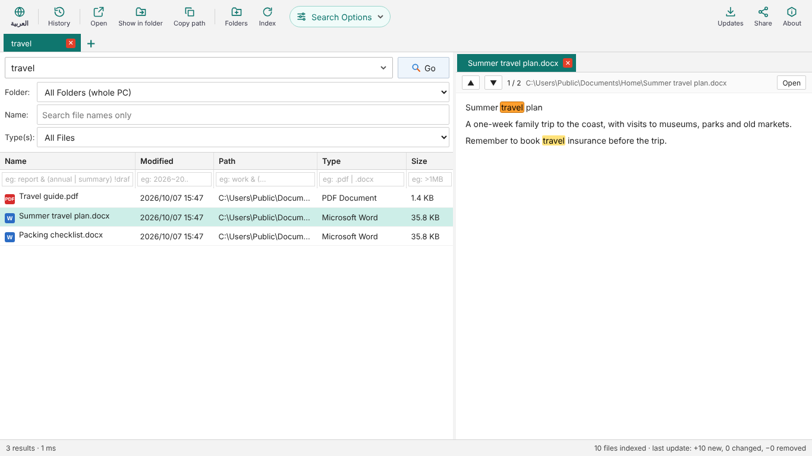

# DocSeeker

**Fast full-text file search for Windows — with real Arabic support.**
**بحث سريع داخل محتوى الملفات على ويندوز — مع دعم حقيقي للغة العربية.**

🌐 Website / الموقع: https://mahmoudhcu2026.github.io/docseeker/

⬇️ **[Download DocSeeker-Setup.zip / تنزيل البرنامج](https://github.com/mahmoudhcu2026/docseeker/releases/latest/download/DocSeeker-Setup.zip)**

## Features
- Searches inside Word, Excel, PowerPoint, PDF and text files, not just file names.
- Arabic-aware: finds words regardless of hamza/alef forms, taa marbuta, diacritics.
- Works fully offline — your files never leave your PC.
- OneDrive-safe: online-only files are never downloaded (name search only).
- Right-click a result to open it, open its folder, copy its path, or share it via WhatsApp / Gmail.
- Arabic and English interface.

## المزايا
- يبحث داخل ملفات Word وExcel وPowerPoint وPDF والملفات النصية، وليس في الأسماء فقط.
- يفهم العربية: يجد الكلمة مهما اختلفت الهمزة أو التاء المربوطة أو التشكيل.
- يعمل دون إنترنت — ملفاتك لا تغادر جهازك.
- آمن مع OneDrive: لا يُنزِّل الملفات غير المحفوظة على الجهاز.
- انقر بالزر الأيمن على أي نتيجة لفتحها أو فتح مجلدها أو نسخ مسارها أو مشاركتها عبر واتساب أو Gmail.
- واجهة عربية وإنجليزية.

## Install / التثبيت
1. Download `DocSeeker-Setup.zip` and extract it. — نزّل الملف وفك الضغط عنه.
2. Run `DocSeeker-Setup.exe`. If Windows shows "Windows protected your PC", click **More info → Run anyway**. — شغّل الملف، وإذا ظهرت رسالة الحماية اضغط **مزيد من المعلومات ← التشغيل على أي حال**.
3. Choose the folders to index and start searching. — اختر المجلدات وابدأ البحث.

Requires Windows 10 or 11 (Microsoft Edge is used for the window).

Questions or suggestions / للأسئلة والاقتراحات: https://github.com/mahmoudhcu2026/docseeker/issues
